## Task 1

The common role and docker tasks were refactored to utilize blocks and tags for higher maintainability, rescue in case of failure, and flexibility.

> Question: What happens if rescue block also fails?

If `rescue` block fails, then the entire block it is a part of is considered failed, causing the triggering command to fail.

> Question: Can you have nested blocks?

Yes, Ansible supports nested blocks. Nested blocks inherit the `become` and tags of the parent block. Any failure in the nested block is propagated to the parent block, so that its `rescue` can recover from it.

> Question: How do tags inherit to tasks within blocks?

Tags propagate to all tasks within the current block and all of its nested blocks (unless overriden).

___

**Test only docker provision:**:
```bash
ansible-playbook -i inventory/hosts.ini playbooks/provision.yml --tags "docker"
```

**Success case:**
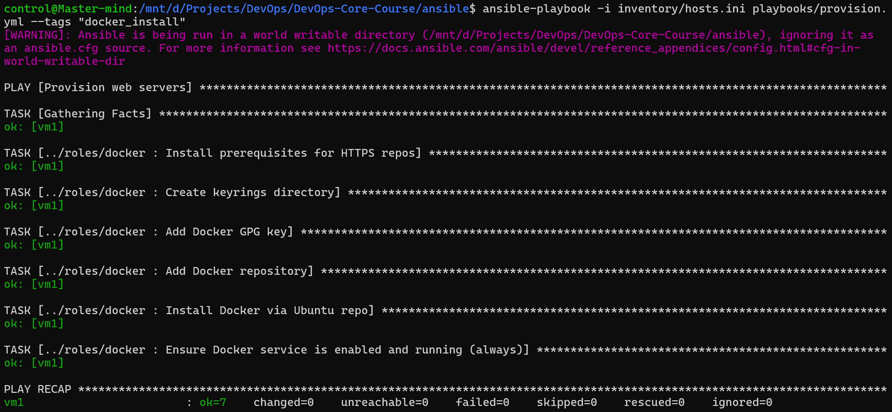

**Failure case:**
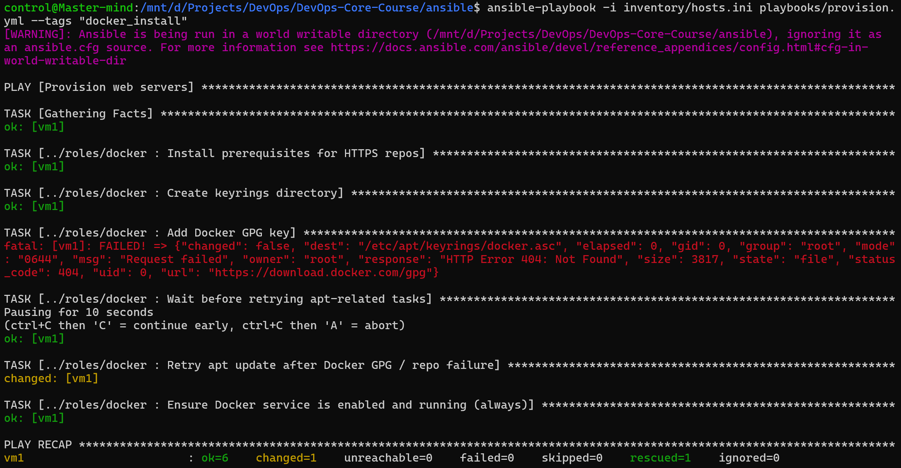

**Skip common role**:
```bash
ansible-playbook -i inventory/hosts.ini playbooks/provision.yml --skip-tags "common"
```

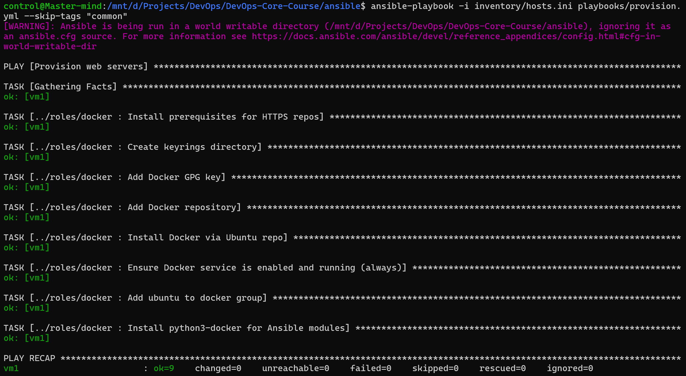

**Install packages only across all roles**:
```bash
ansible-playbook -i inventory/hosts.ini playbooks/provision.yml --tags "packages"
```

**Success case:**
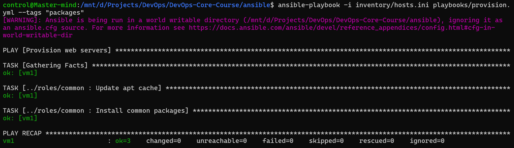

**Fail case:**
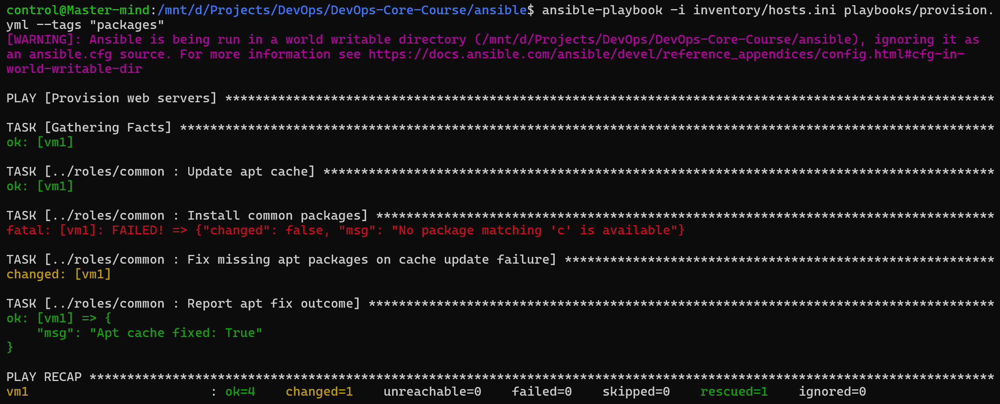

**Check mode to see what would run:**
```bash
ansible-playbook -i inventory/hosts.ini playbooks/provision.yml --tags "docker" --check
```

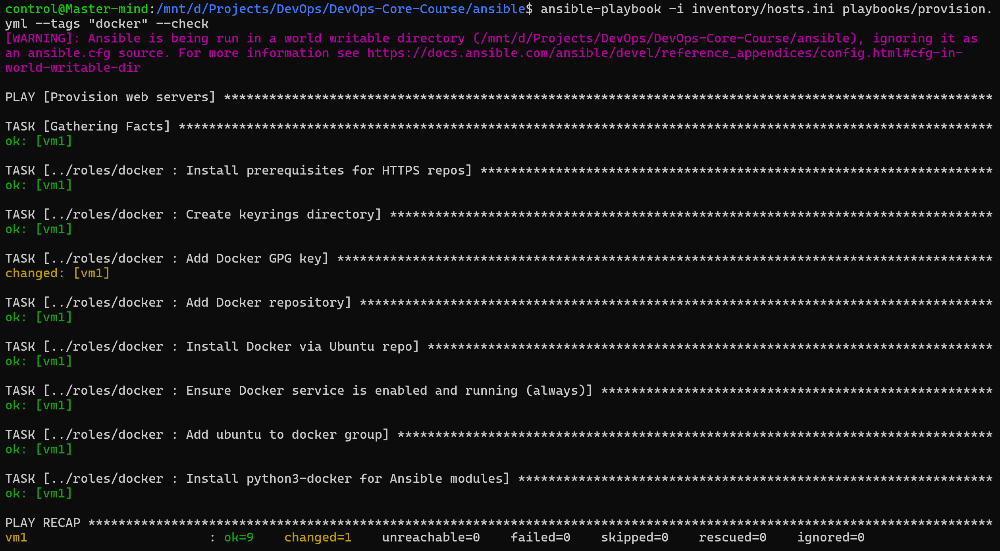

**Run only docker installation tasks:**
```bash
ansible-playbook -i inventory/hosts.ini playbooks/provision.yml --tags "docker_install"
```

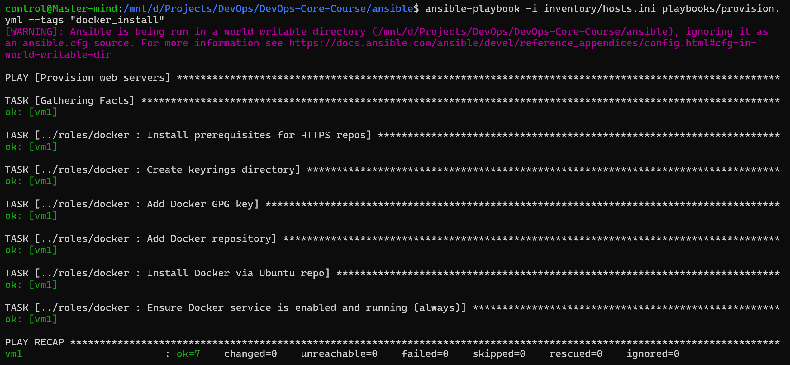

**List all available tags:**
```bash
ansible-playbook -i inventory/hosts.ini playbooks/provision.yml --tags "docker_install"
```
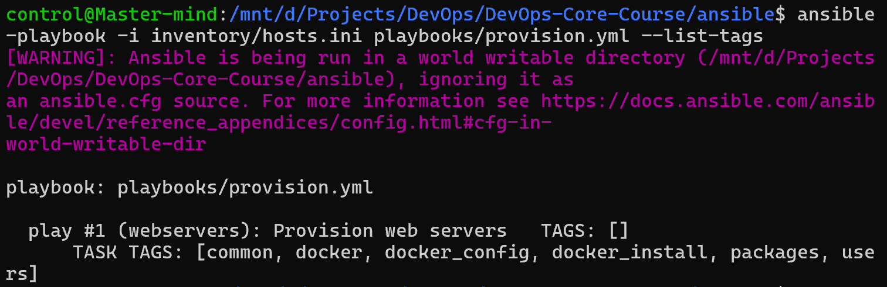


## Task 2

> What's the difference between `restart: always` and `restart: unless-stopped`?

The `restart: always` setting instructs the docker daemon to restart the container regardless of the reason for its stop. Conversely, `restart: unless-stopped` only restarts the container if it was not manually stopped by the user.

> How do Docker Compose networks differ from Docker bridge networks?

The docker compose networks' lifecycle is managed by docker compose, including creation and deletion. It also enables domain name resolution by service name, making networking in docker compose more convenient. The underlying technology, however is mostly the same.

> Can you reference Ansible Vault variables in the template?

Yes. In case of normal varibles, they can be included via the standard referencing. If the variables are secret, they can either be included in the encrypted form directly, or be referenced in a file. Ansible must first decrypt the values before they can be used in the template.

```bash
control@Master-mind:/mnt/d/Projects/DevOps/DevOps-Core-Course/ansible$ ansible-playbook -i inventory/hosts.ini playbooks/provision.yml
[WARNING]: Ansible is being run in a world writable directory (/mnt/d/Projects/DevOps/DevOps-Core-Course/ansible), ignoring it as
an ansible.cfg source. For more information see https://docs.ansible.com/ansible/devel/reference_appendices/config.html#cfg-in-
world-writable-dir

PLAY [Provision web servers] ******************************************************************************************************

TASK [Gathering Facts] ************************************************************************************************************
The authenticity of host '111.88.156.95 (111.88.156.95)' can't be established.
ED25519 key fingerprint is SHA256:BXcbmoXLsVBTf8tJ+yqYXvW2V7TyMurCVcjmR7077Js.
This key is not known by any other names.
Are you sure you want to continue connecting (yes/no/[fingerprint])? yes
ok: [vm1]

TASK [../roles/common : Update apt cache] *****************************************************************************************
changed: [vm1]

TASK [../roles/common : Install common packages] **********************************************************************************
changed: [vm1]

TASK [../roles/common : Add ubuntu user to sudo group] ****************************************************************************
changed: [vm1]

TASK [../roles/common : Set system timezone] **************************************************************************************
changed: [vm1]

TASK [../roles/common : Log common role completion] *******************************************************************************
changed: [vm1]

TASK [../roles/docker : Install prerequisites for HTTPS repos] ********************************************************************
ok: [vm1]

TASK [../roles/docker : Create keyrings directory] ********************************************************************************
ok: [vm1]

TASK [../roles/docker : Add Docker GPG key] ***************************************************************************************
changed: [vm1]

TASK [../roles/docker : Add Docker repository (modern .sources format)] ***********************************************************
changed: [vm1]

TASK [../roles/docker : Update apt cache] *****************************************************************************************
changed: [vm1]

TASK [../roles/docker : Install Docker Engine and Compose v2 plugin] **************************************************************
changed: [vm1]

TASK [../roles/docker : Ensure Docker service is enabled and running (always)] ****************************************************
ok: [vm1]

TASK [../roles/docker : Add ubuntu to docker group] *******************************************************************************
changed: [vm1]

TASK [../roles/docker : Install python3-docker for Ansible modules] ***************************************************************
changed: [vm1]

TASK [docker : Install prerequisites for HTTPS repos] *****************************************************************************
ok: [vm1]

TASK [docker : Create keyrings directory] *****************************************************************************************
ok: [vm1]

TASK [docker : Add Docker GPG key] ************************************************************************************************
ok: [vm1]

TASK [docker : Add Docker repository (modern .sources format)] ********************************************************************
ok: [vm1]

TASK [docker : Update apt cache] **************************************************************************************************
changed: [vm1]

TASK [docker : Install Docker Engine and Compose v2 plugin] ***********************************************************************
ok: [vm1]

TASK [docker : Ensure Docker service is enabled and running (always)] *************************************************************
ok: [vm1]

TASK [docker : Add ubuntu to docker group] ****************************************************************************************
ok: [vm1]

TASK [docker : Install python3-docker for Ansible modules] ************************************************************************
ok: [vm1]

TASK [../roles/web_app : Create app directory] ************************************************************************************
changed: [vm1]

TASK [../roles/web_app : Template docker-compose file] ****************************************************************************
changed: [vm1]

TASK [../roles/web_app : Copy version.env to project directory] *******************************************************************
changed: [vm1]

TASK [../roles/web_app : Deploy with docker-compose] ******************************************************************************
changed: [vm1]

PLAY RECAP ************************************************************************************************************************
vm1                        : ok=28   changed=16   unreachable=0    failed=0    skipped=0    rescued=0    ignored=0

control@Master-mind:/mnt/d/Projects/DevOps/DevOps-Core-Course/ansible$ ansible-playbook -i inventory/hosts.ini playbooks/provision.yml
[WARNING]: Ansible is being run in a world writable directory (/mnt/d/Projects/DevOps/DevOps-Core-Course/ansible), ignoring it as
an ansible.cfg source. For more information see https://docs.ansible.com/ansible/devel/reference_appendices/config.html#cfg-in-
world-writable-dir

PLAY [Provision web servers] ******************************************************************************************************

TASK [Gathering Facts] ************************************************************************************************************
ok: [vm1]

TASK [../roles/common : Update apt cache] *****************************************************************************************
ok: [vm1]

TASK [../roles/common : Install common packages] **********************************************************************************
ok: [vm1]

TASK [../roles/common : Add ubuntu user to sudo group] ****************************************************************************
ok: [vm1]

TASK [../roles/common : Set system timezone] **************************************************************************************
ok: [vm1]

TASK [../roles/common : Log common role completion] *******************************************************************************
changed: [vm1]

TASK [../roles/docker : Install prerequisites for HTTPS repos] ********************************************************************
ok: [vm1]

TASK [../roles/docker : Create keyrings directory] ********************************************************************************
ok: [vm1]

TASK [../roles/docker : Add Docker GPG key] ***************************************************************************************
ok: [vm1]

TASK [../roles/docker : Add Docker repository (modern .sources format)] ***********************************************************
ok: [vm1]

TASK [../roles/docker : Update apt cache] *****************************************************************************************
changed: [vm1]

TASK [../roles/docker : Install Docker Engine and Compose v2 plugin] **************************************************************
ok: [vm1]

TASK [../roles/docker : Ensure Docker service is enabled and running (always)] ****************************************************
ok: [vm1]

TASK [../roles/docker : Add ubuntu to docker group] *******************************************************************************
ok: [vm1]

TASK [../roles/docker : Install python3-docker for Ansible modules] ***************************************************************
ok: [vm1]

TASK [docker : Install prerequisites for HTTPS repos] *****************************************************************************
ok: [vm1]

TASK [docker : Create keyrings directory] *****************************************************************************************
ok: [vm1]

TASK [docker : Add Docker GPG key] ************************************************************************************************
ok: [vm1]

TASK [docker : Add Docker repository (modern .sources format)] ********************************************************************
ok: [vm1]

TASK [docker : Update apt cache] **************************************************************************************************
changed: [vm1]

TASK [docker : Install Docker Engine and Compose v2 plugin] ***********************************************************************
ok: [vm1]

TASK [docker : Ensure Docker service is enabled and running (always)] *************************************************************
ok: [vm1]

TASK [docker : Add ubuntu to docker group] ****************************************************************************************
ok: [vm1]

TASK [docker : Install python3-docker for Ansible modules] ************************************************************************
ok: [vm1]

TASK [../roles/web_app : Create app directory] ************************************************************************************
ok: [vm1]

TASK [../roles/web_app : Template docker-compose file] ****************************************************************************
ok: [vm1]

TASK [../roles/web_app : Copy version.env to project directory] *******************************************************************
ok: [vm1]

TASK [../roles/web_app : Deploy with docker-compose] ******************************************************************************
ok: [vm1]

PLAY RECAP ************************************************************************************************************************
vm1                        : ok=29   changed=3    unreachable=0    failed=0    skipped=0    rescued=0    ignored=0
```

> Document why dependency is needed
> Dependency on docker role ensures that whenever deployment is being performed docker is already properly installed.

**Proof of deployment:**
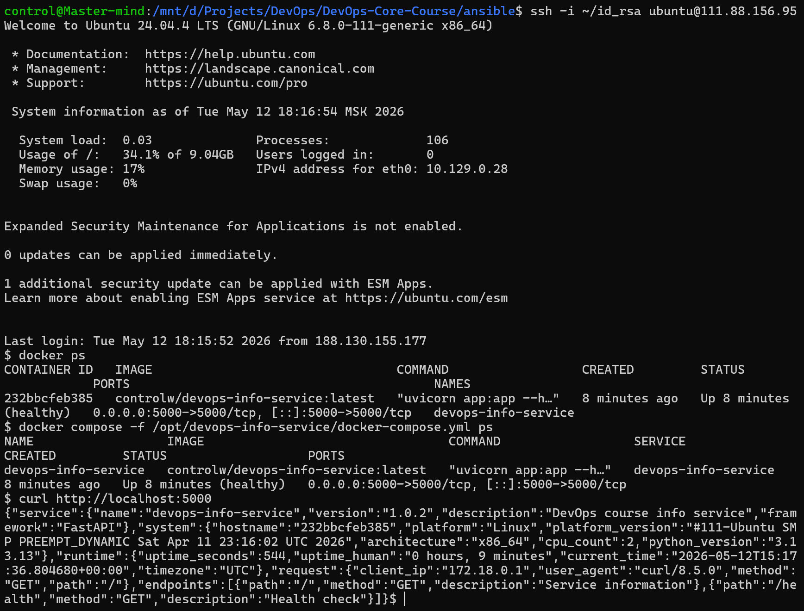

**The docker-compose file built from the template:**
```yaml
services:
  devops-info-service:
    image: controlw/devops-info-service:latest
    container_name: devops-info-service
    ports:
      - "5000:5000"
    env_file:
      - version.env
    healthcheck:
      test: ['CMD', 'python', '/app/healthcheck.py']
      interval: 30s
      timeout: 5s
      start_period: 10s
      retries: 3
    restart: unless-stopped
```

## Task 3

**Scenario 1, normal deployment:**
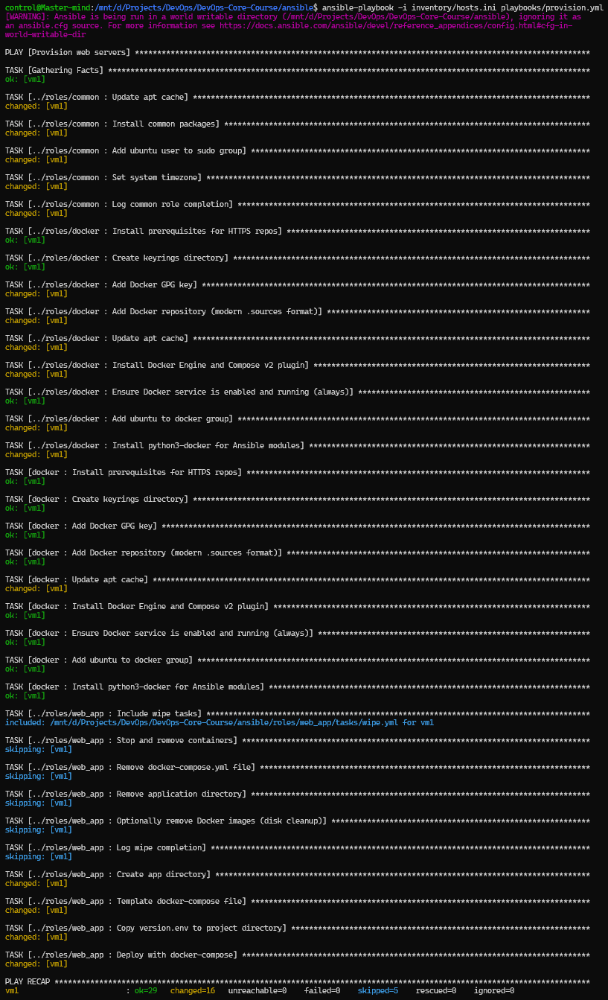

**Scenario 2, wipe-only operation:**
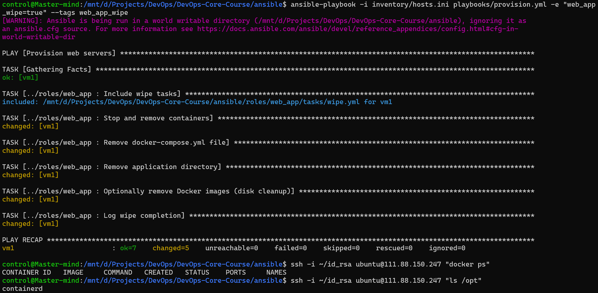

**Scenario 3, clean reinstall:**
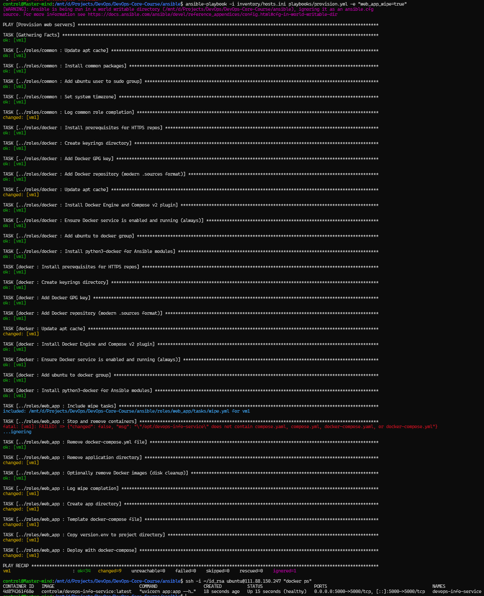

**Scenario 4a, wipe blocked by condition:**
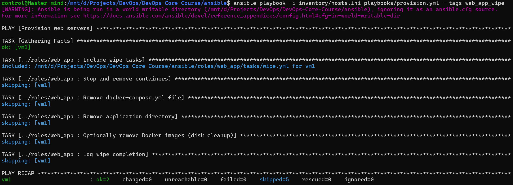

**Scenario 4b, deployment skipped:**


**Running app proof after clean reinstall:**
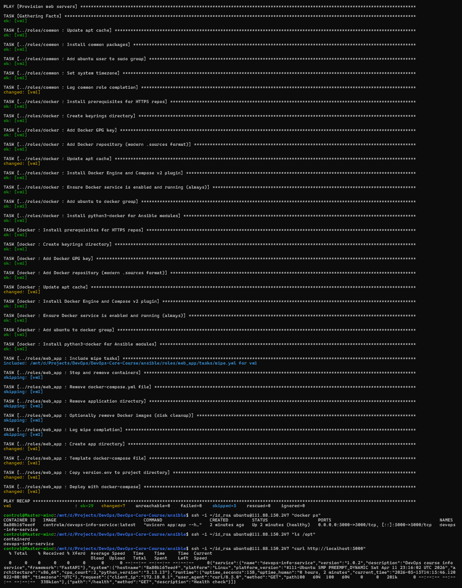

> Question: Why use both variable AND tag?

The tag specifies which tasks to execute, while the variable allows to clearly state the intention to wipe the application.

> Question: What's the difference between never tag and this approach?

The special `never` tag is used to avoid accidental execution of dangerous tasks, making tasks marked by it not execute by default. The approach with a custom tag and a variable enforces clarity of decision, making accidental tear-downs near-impossible.

> Question: Why must wipe logic come BEFORE deployment in main.yml? (Clean reinstall scenario)

If wipe logic were to come after the deployment, it would simply tear-down the app that was just deployed, making the action useless.

> Question: When would you want clean reinstallation vs. rolling update?

A clean reinstallation is suitable in development environments and for test suited. On the other hand, production environments require a rolling update since the data and accumulated state are of vital importance.

> Question: How would you extend this to wipe Docker images and volumes too?

I would use `community.docker.docker_image_remove` with an image specified through a variable and `community.docker.docker_volume` with `state: absent` and a variable-injected volume name.
