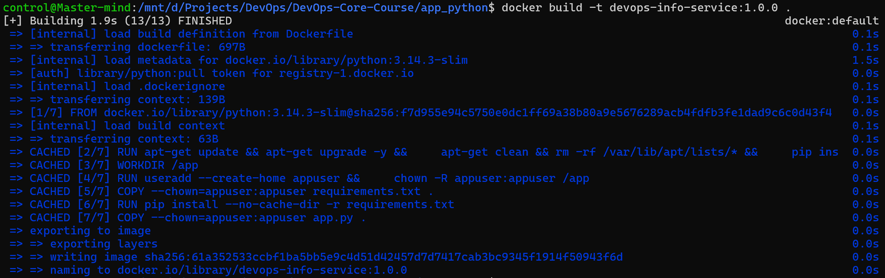
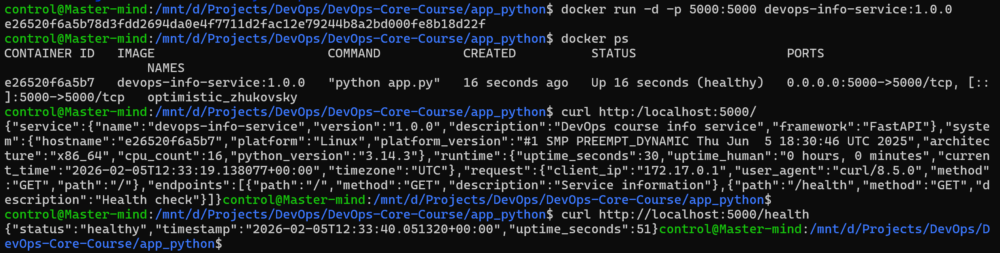
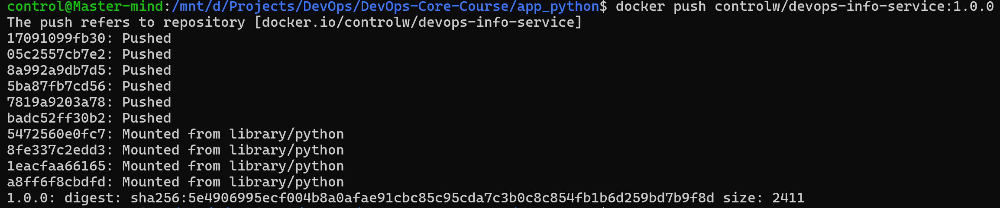

## Implemented practices

1. Using slim image

- **Why does it matter?**
    - Choosing the slim version minimizes the image size while ensuring that minimally required binaries are present
    - Choosing the slim version minimizes attack surface on the future container

The latest stable release is pinned for reproducibility:
```Dockerfile
FROM python:3.14.3-slim
```

2. Upgrading all installed packages

- **Why does it matter?**
    - Upgrading packages to the latest version minimizes security vulnerabilities

The first step of the dockerfile is to upgrade all the packages:
```Dockerfile
RUN apt-get update && apt-get upgrade -y
```

3. Clean-up of installation leftover files

- **Why does it matter?**
    - Minimizes the image size
    - Minimizes the attack surface

Clean-up is performed right after updating the packages:
```Dockerfile
apt-get clean && rm -rf /var/lib/apt/lists/*
```

4. Non-root user

- **Why does it matter?**
    - Minimizes the damage from successful attacks
    - Limits privelege escalation

This command creates the new user and the corresponding home directory for binaries that rely on its presence:
```Dockerfile
RUN useradd --create-home appuser && \
    chown -R appuser:appuser /app
...
USER appuser
```

5. Proper layer ordering

- **Why does it matter?**
    - Minimizes build time by resuing the unchanged layers
    - Minimizes the network delivery time by locally caching shared layers between images

6. Built-in healthcheck procedure

- **Why does it matter?**
    - Provides near real-time insight into a container's health
    - Helps in debugging and identifying issues early in the lifecycle

This command queries the `/health` endpoint every 30 seconds after a startup period of 30 seconds:
```Dockerfile
HEALTHCHECK --interval=30s --timeout=10s --start-period=30s \
  CMD python -c "import urllib.request, json; urllib.request.urlopen('http://localhost:5000/health', timeout=5)" || exit 1
```


## Image Information & Decisions

The `python:3.14.3-slim` image was chosen as the base image. The primary reasons are:
1. It is the latest stable python version
2. This is the slim (minimized) version

Final image size is 174MB.

**Layes Structure Optimization**:
1. Base image, never changes unless replaced explicitly
2. Upgrade and cleanup of all the packages
3. Create a new non-root user
4. Install all required dependencies
5. Copy the source code

The layers are written in the order of ascending probability of change.


## Build & Run Process

Docker image building process:


Running and testing the container:


Pushing the image to DockerHub:


The image can be found on [DockerHub](https://hub.docker.com/repository/docker/controlw/devops-info-service/general).

- **Tagging strategy**: Use three-digit versions to clearly pin the change history.


## Technical Analysis

- Why does your Dockerfile work the way it does?
    - Because it is written in this specific manner
- What would happen if you changed the layer order?
    - Some changes in ordering can break the build process, but the majority of potential changes would prevent efficient caching and thus inflate the build time
- What security considerations did you implement?
    - Minimal base image, non-root user
- How does .dockerignore improve your build?
    - It significantly cuts the build context that is sent to Docker Daemon, thus making the build faster


## Challenges & Solutions

The key issue I ecountered was the unintuitive behaviour of the healthcheck instruction set. After observing the healthy and unhealthy states, I realized that the healthcheck failed due to lack of curl installation. Then, I rewritten the instruction to rely on base Python library instead.
