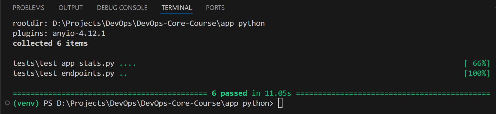

### Testing Framework Choice

Given `unittest` and `pytest` as two primary options, I focused my attention on the features that hold most relevance for this project: test discovery, setup/teardown (fixture) mechanisms, and depth of introspective into failed assert statements. All these features have best coverage in `pytest`, thus that is my choice.


### Test Structure

The tests cover AppStats, the primarily used class of the app, and service endpoints to ensure adequate API outputs. As such, the implemented tests are:

```
tests/
    test_app_stats.py
        test_init_integrity_break()
        test_service_info()
        test_system_info_consistency()
        test_runtime_info_progression()
    test_endpoints.py
        test_root(client: TestClient)
        test_health(client: TestClient)
```


### Running Tests Locally

To run the tests, first navigate to the project root and install the necessary toolset:
```bash
curl -LsSf https://astral.sh/uv/install.sh | sh
cd app_python
uv sync --dev --locked --no-install-project
```

Then,  and launch pytest on the entire test set:
```bash
uv run pytest tests/
```


### Proof of Validity

Below is a screenshot of all tests passing locally:




### Dependency Caching

I implemented dependency caching with `uv`:

```Dockerfile
COPY pyproject.toml uv.lock /app
ENV UV_LINK_MODE=copy
RUN --mount=type=cache,target=/root/.cache/uv \ 
	uv sync --no-dev --locked --no-install-project --no-editable
```

To assess the build time speedup provided by caching dependencies, I used:

```bash
time docker build \
  --build-arg MAJOR_VERSION=1 \
  --build-arg MINOR_VERSION=0 \
  --build-arg PATCH_VERSION=2 \
  -t devops-info-service:test app_python
```

The result are as following:

| Scenario | Real Time | User Time | System Time | Speedup   |
| -------- | --------- | --------- | ----------- | --------- |
| No Cache | 14.955s   | 0.247s    | 0.531s      | Baseline  |
| Cached   | 2.991s    | 0.176s    | 0.265s      | 5x faster |


### Vulnerability Report Assessment

`Snyk` was used to scan the final image for vulnerabilities:

```
✗ Medium severity vulnerability found in systemd/libsystemd0
  Description: Improper Access Control
  Info: https://security.snyk.io/vuln/SNYK-DEBIAN13-SYSTEMD-15656985
  Introduced through: systemd/libsystemd0@257.9-1~deb13u1, apt@3.0.3, coreutils@9.7-3, util-linux@2.41-5, util-linux/bsdutils@1:2.41-5, adduser@3.152, systemd/libudev1@257.9-1~deb13u1
  From: systemd/libsystemd0@257.9-1~deb13u1
  From: apt@3.0.3 > systemd/libsystemd0@257.9-1~deb13u1
  From: coreutils@9.7-3 > systemd/libsystemd0@257.9-1~deb13u1
  and 8 more...

✗ High severity vulnerability found in ncurses/libtinfo6
  Description: Stack-based Buffer Overflow
  Info: https://security.snyk.io/vuln/SNYK-DEBIAN13-NCURSES-15762838
  Introduced through: ncurses/libtinfo6@6.5+20250216-2, bash/bash@5.2.37-2+b7, ncurses/libncursesw6@6.5+20250216-2, ncurses/ncurses-bin@6.5+20250216-2, readline/libreadline8t64@8.2-6, util-linux@2.41-5, ncurses/ncurses-base@6.5+20250216-2
  From: ncurses/libtinfo6@6.5+20250216-2
  From: bash/bash@5.2.37-2+b7 > ncurses/libtinfo6@6.5+20250216-2
  From: ncurses/libncursesw6@6.5+20250216-2 > ncurses/libtinfo6@6.5+20250216-2
  and 6 more...
```

These vulnerabilities do not have patches yet.
