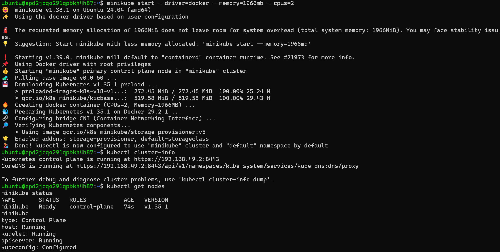
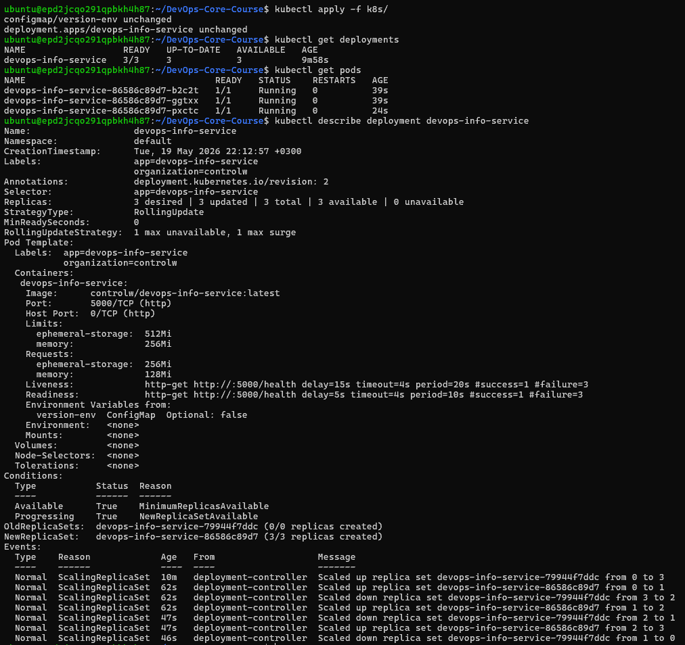
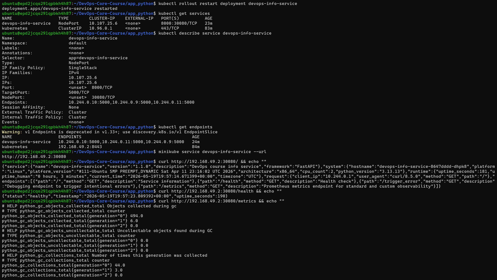

## Task 1

Given `minikube` and `kind` as two options, `minikube` was chosen because its feature-rich and production-like qualities make it more suitable for learning and local experimentation.

**Kubectl and minikube setup proof:**

## Task 2

The Deployment, ConfigMap, and Service have been written.

**Apply proof:**

## Task 3

The service type has been change to meet the requirements.

**Service apply proof:**

