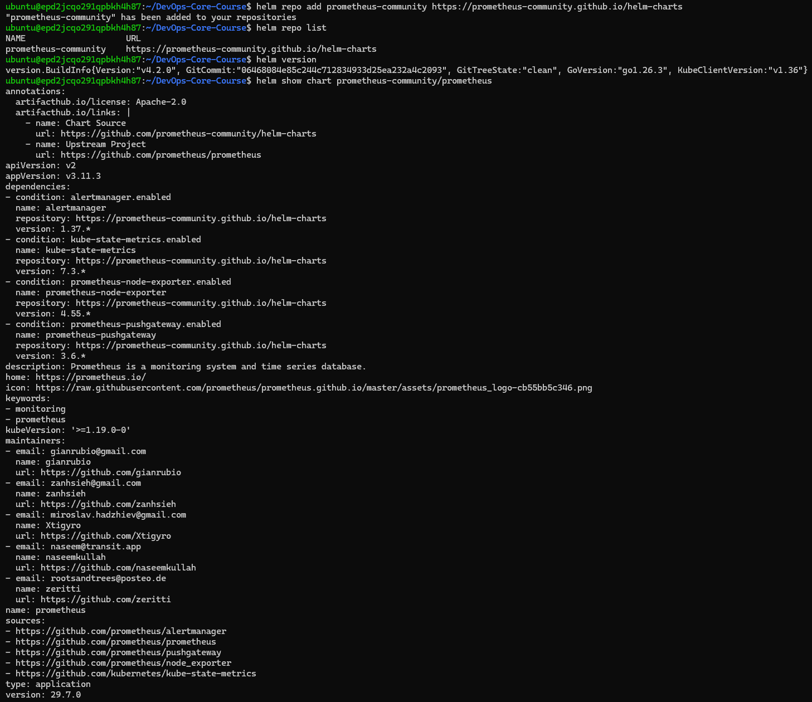
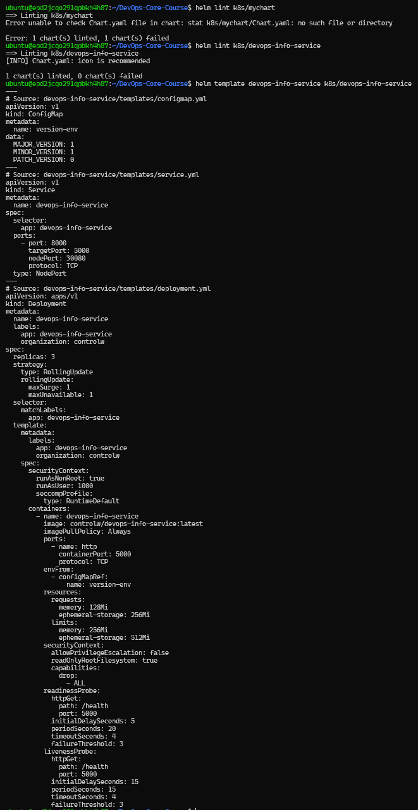
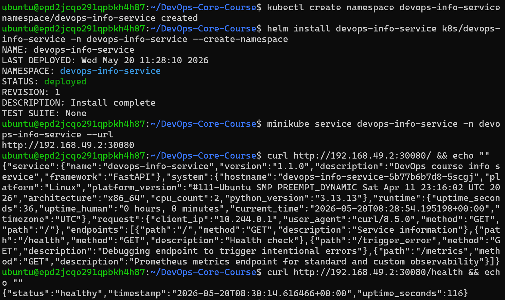
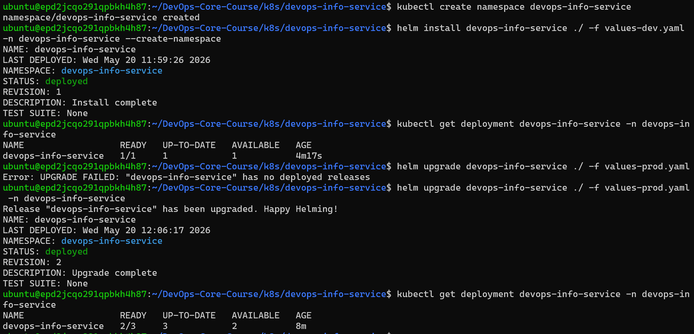

## Task 1

**Helm basics:**

**Helm's value proposition:**
Helm enables encapsulation of Kubernetes deployments into reusable and combinable charts. Intentional separation of abstractions and configurable details enables reuse of the same app across environments with different settings. Separation into charts allows to combine and build upon existing components when deploying more complex systems, changing releases, or reverting.

## Task 2

**Helm chart setup:**

**Helm deployment proof:**

## Task 3

**Multi-environment setup:**

