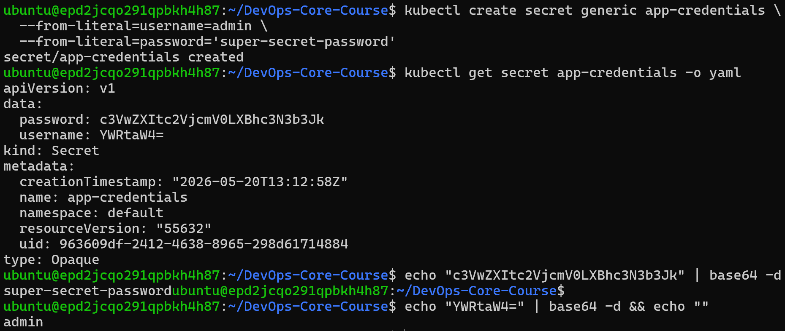
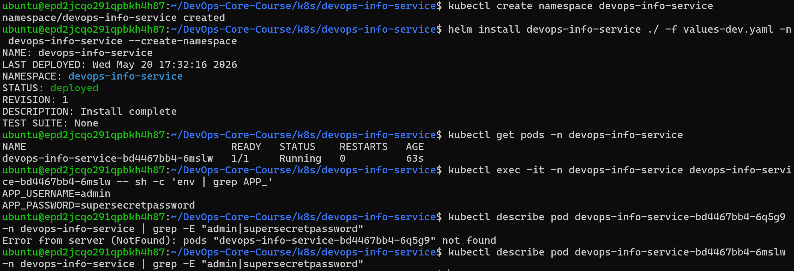
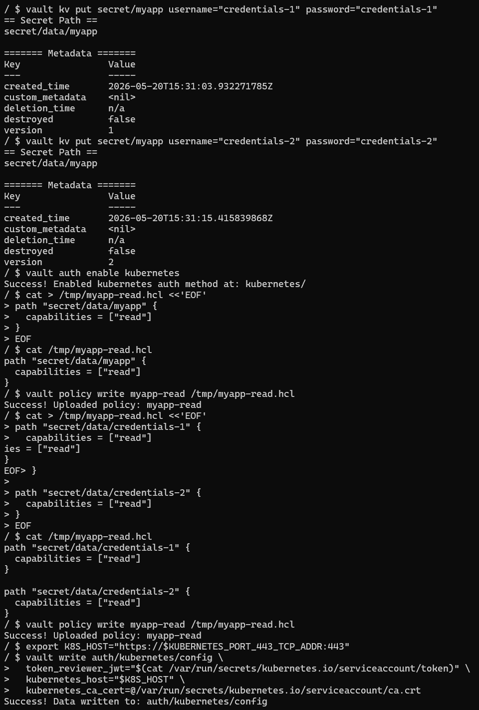
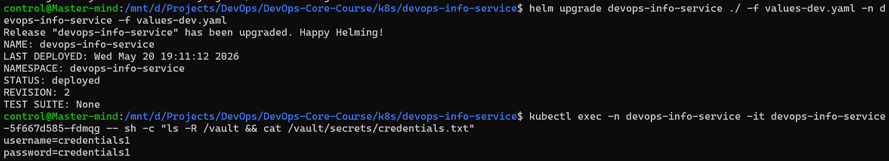

## Task 1

**Basic secrets:**

> Question: Understand what "encoding" vs "encryption" means

Encoding is a process of representing information in a symbol system. It allows information to be transmitted, but does not protect confidentiality or integrity of the information. Encryption, on the other hand, is a process through which an encoded message changes its symbolic reperesentation to prevent unauthorized reads.

> Question: Are Kubernetes Secrets encrypted at rest by default?

No, by default kubernetes secrets are stored in an encoded format in `etcd`. Encryption at rest is an additonal protection layer that should be enabled explicitly.

> Question: What is etcd encryption and when should you enable it?

Encryption of `etcd` is a protective measure to reinforce cluster security. The API server encrypts the secrets before storing them in `etcd`, and decrypts them upon retrieval. It should be enabled when we want to minimize the probability of credential-requiring components being compromised.

## Task 2

**Secret exec verification:**

## Task 3

Vault setup.

**Vault internal setup:**

**Extraction step**:

