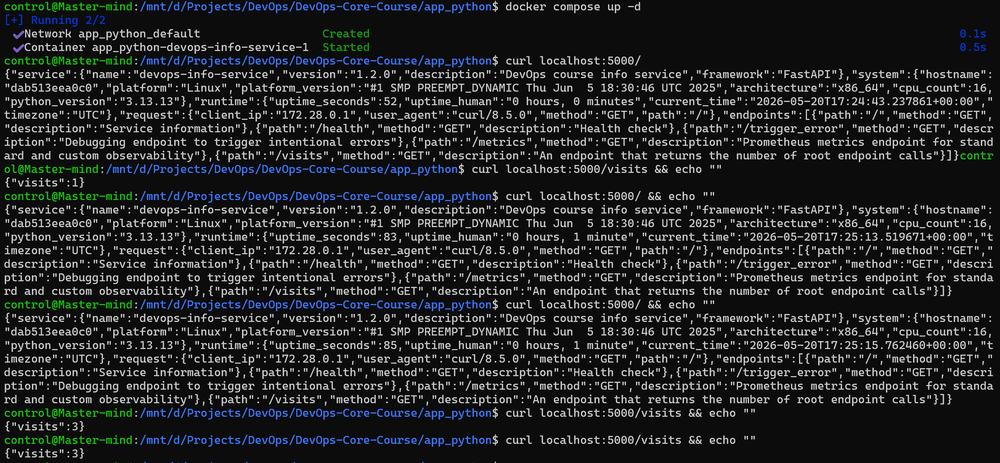
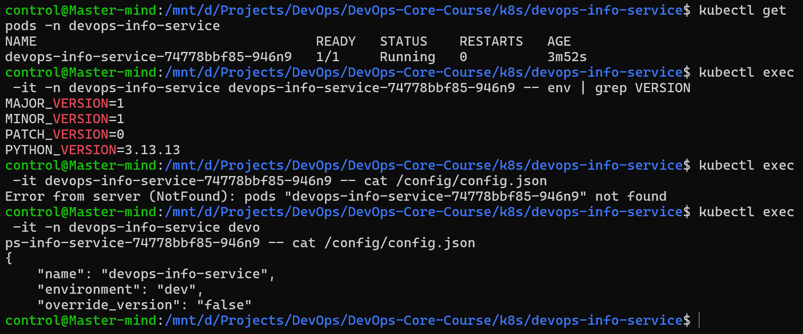
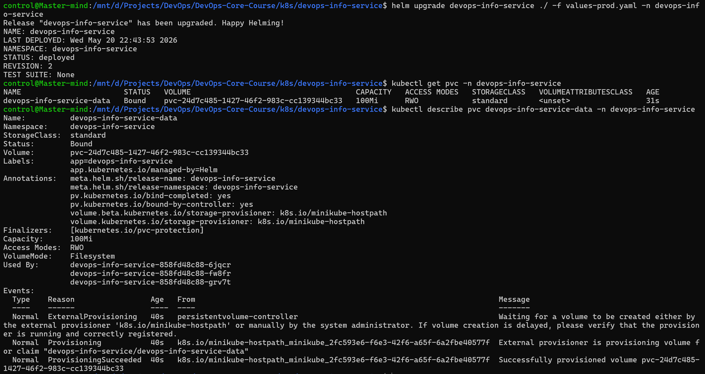
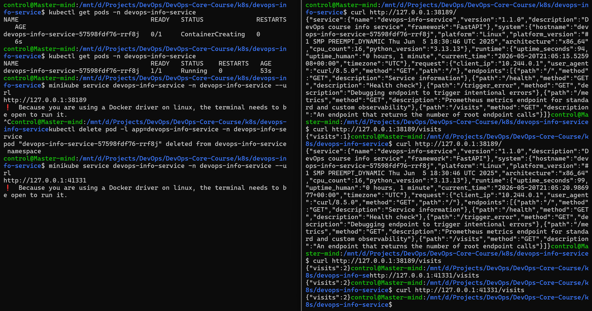

## Task 1

Persistent call count tracking was implemented via docker volumes.

**Peristent visits:**

## Task 2

A ConfigMap for `config.json` and a ConfigMap for injecting environment variables were created and their effect verified.

**ConfigMap verification:**

## Task 3

A persistent volume was used to make `/visits` endpoint behave in a persistent manner.

**Provisioning success:**

**Persistence proof:**

