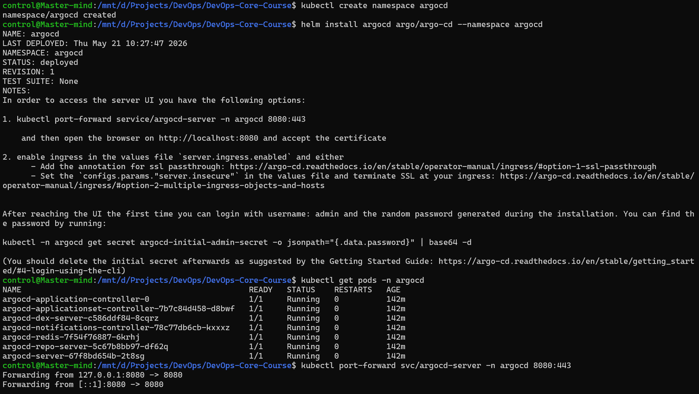
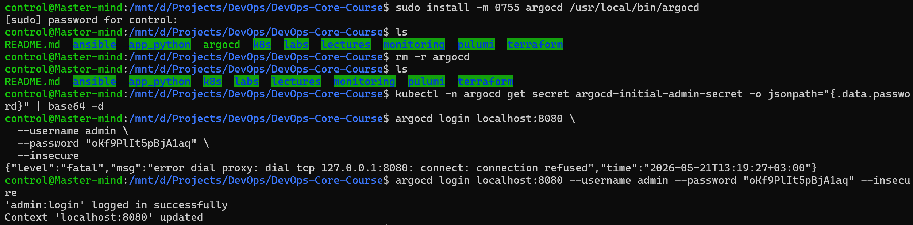
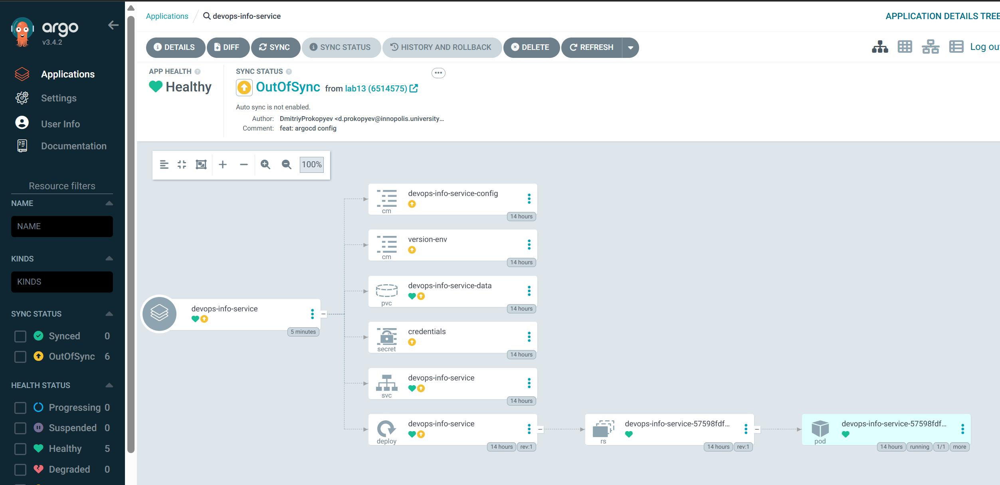
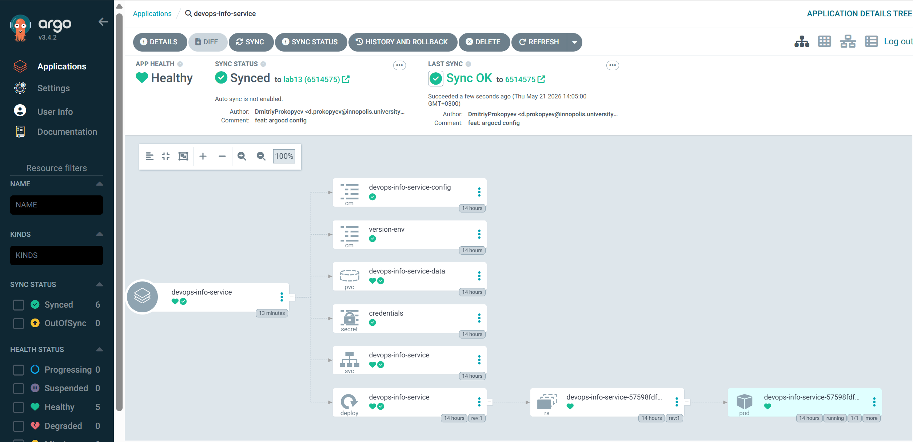
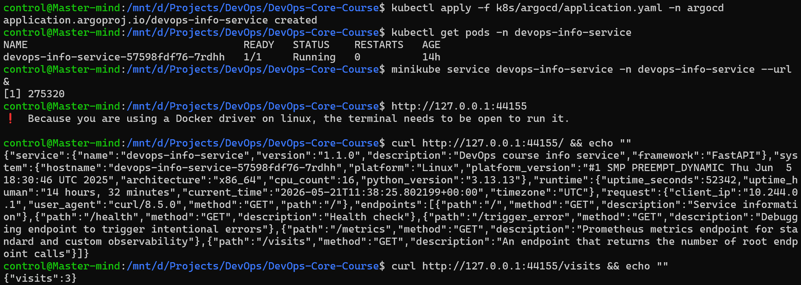
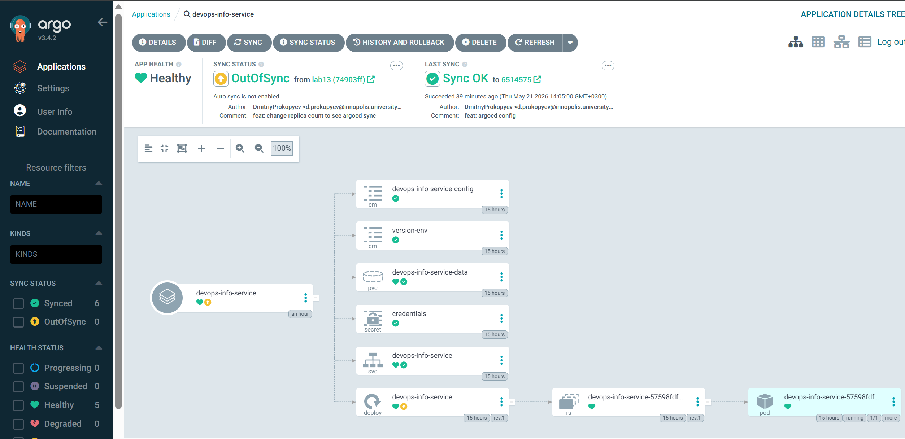
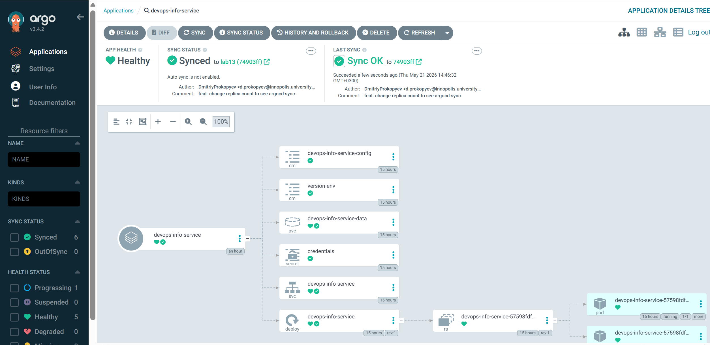

## Task 1

**ArgoCD setup:**

**ArgoCD CLI setup:**

## Task 2

**Application in ArgoCD UI:**

**Synced application:**

**ArgoCD initial sync:**

**ArgoCD out of sync after change:**

**ArgoCD resynced::**

## Task 3

