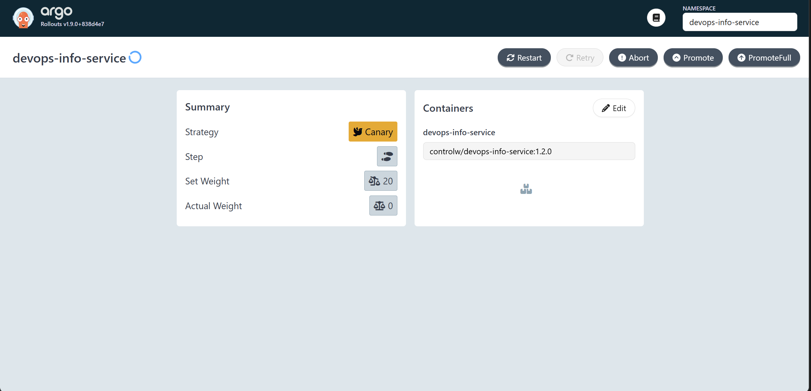
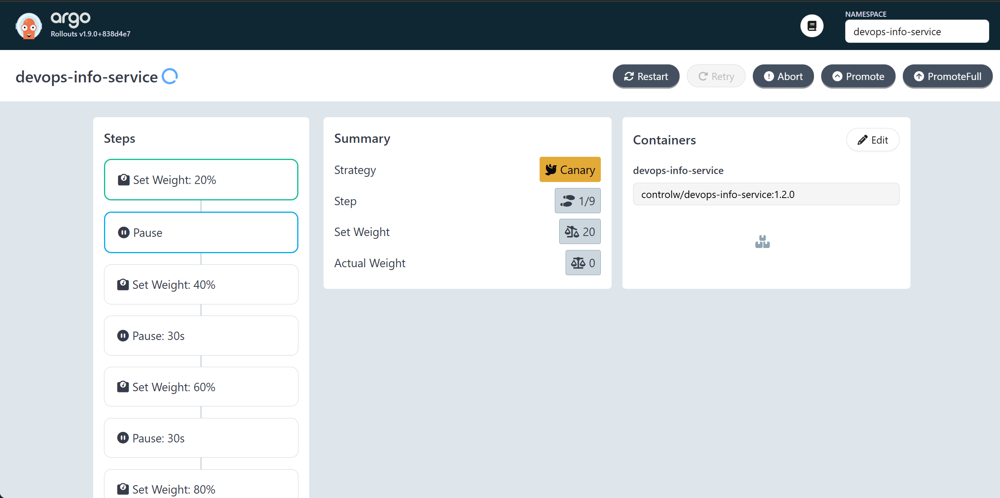
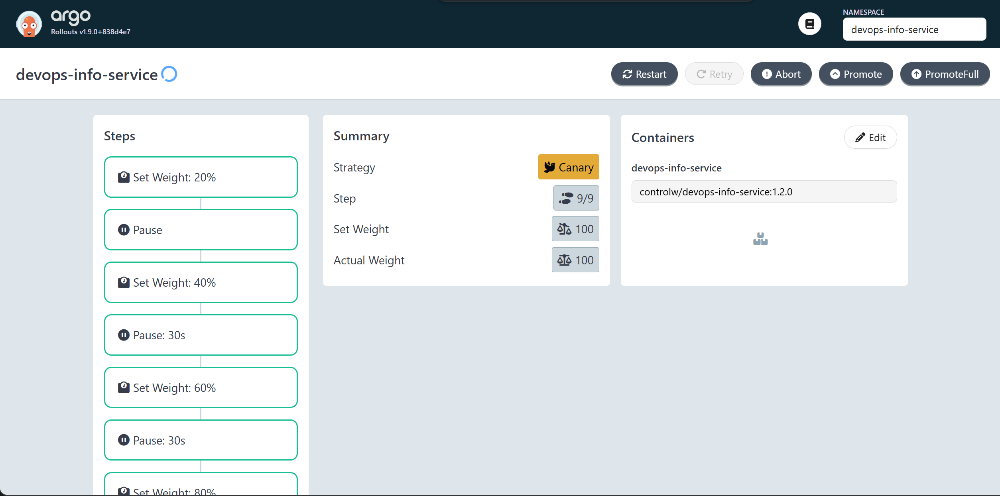

## Task 1

> Compare Rollout CRD with Deployment

A deployment and an argo rollout are both Kubernetes workload objects. Rollouts are a Deployment-like resource with extra progressive-delivery controls. Progressive delivery is a mechanism for controlled releases instead of a simple replace-all update.

> Identify additional fields for progressive delivery

In a normal deployment, the key rollout behavior is defined in the built-in `rollingUpdate` strategy.
In a Rollout, the important extra part is `spec.strategy`, especially canary or blueGreen, plus nested fields such as steps, pause, analysis, etc.

## Task 2

**UI before promotion:**

**20% promotion:**

**Full rollout:**

## Task 3

