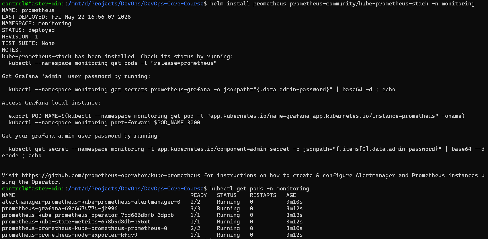
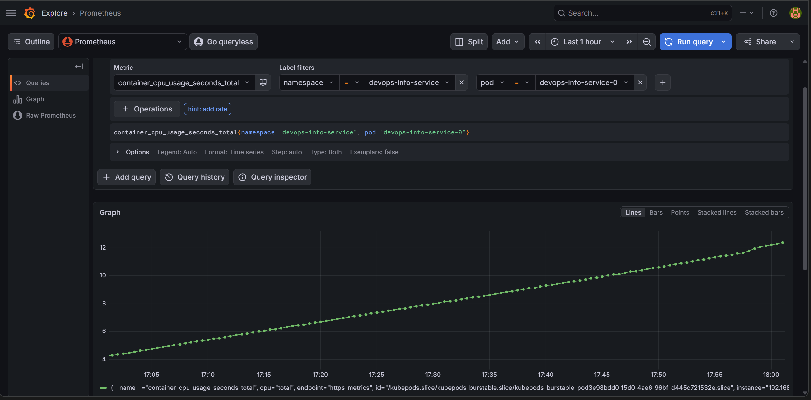
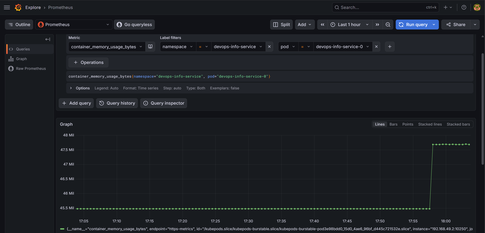
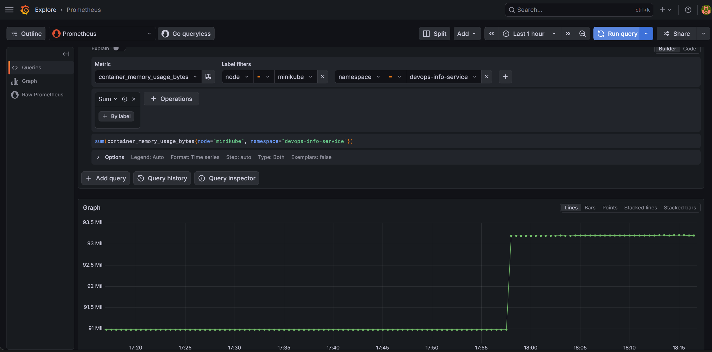
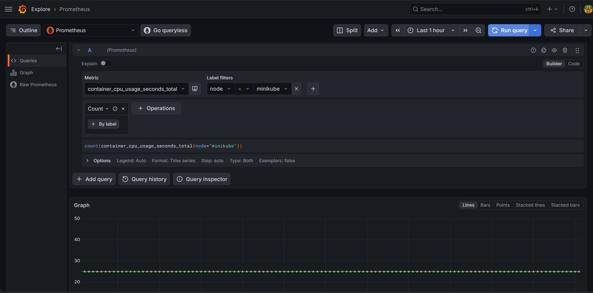
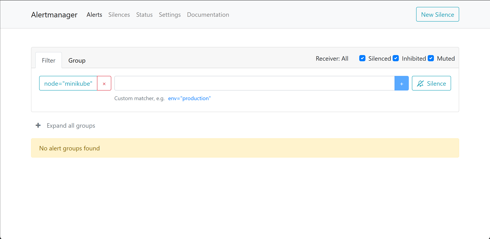
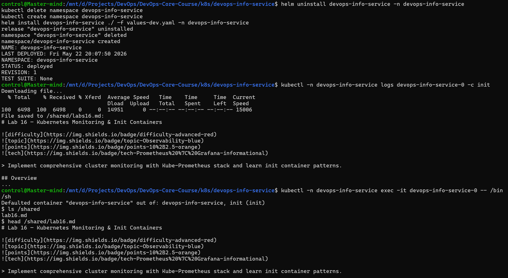

## Task 1

> Document roles of: Prometheus Operator, Prometheus, Alertmanager, Grafana, kube-state-metrics, node-exporter

- Prometheus Operator: automates deployment and configuration of Prometheus and related components on Kubernetes using custom resources.
- Prometheus: pulls metrics from targets over HTTP, stores them as time-series data, and evaluates alert rules and queries with PromQL.
- Alertmanager: receives alerts from Prometheus, deduplicates them, groups them, routes them, and sends notifications to specified channels.
- Grafana: reads metrics from Prometheus and turns them into dashboards, graphs, and operational views for humans.
- `kube-state-metrics`: watches the Kubernetes API and exports metrics about the state of cluster objects.
- `node-exporter`: Runs on each node and exports OS and hardware metrics like CPU, memory, disk, and network usage. 

**Prometheus components ready:**

## Task 2

> Pod Resources: CPU/memory usage of your StatefulSet

Both StatefulSet pods occupied around 12 seconds of CPU time at the moment of measurement.

**CPU total seconds:**

Both StatefulSet pods occupied around 48Mi of memory at the moment of measurement.

**Memory usage bytes:**

> Namespace Analysis: Which pods use most/least CPU in default namespace?

There are no pods in `default` namespace, but there are 2 StatefulSet instances in the `devops-info-service` namespace. Both occupy roughly the same amount of CPU time, however pod 0 occupies slightly more memory because of artificial load.

> Node Metrics: Memory usage, CPU cores

The `minikube` used roughly 93.2Mi of memory at the last measurement.

**Node memory usage:**

> Kubelet: How many pods/containers managed?

**Number of managed containers:**

> Alerts: How many active alerts? Check Alertmanager UI

There are no active alerts.

**Active alerts:**

## Task 3

**Init container proof:**

