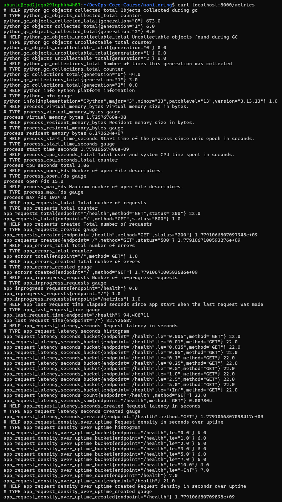
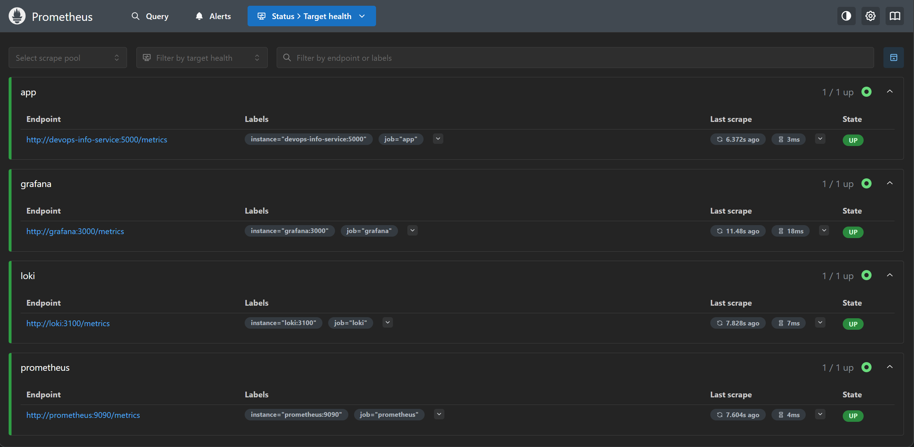
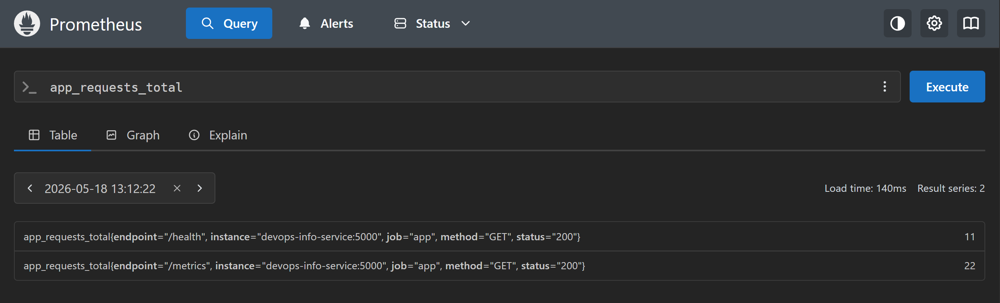

## Task 1

**Metrics choice:**
| Metric Name                       | Metric Type | Metric Meaning                                                 | Metric Rationale                                                    |
| --------------------------------- | ----------- | -------------------------------------------------------------- | ------------------------------------------------------------------- |
| `app_requests_total`              | Counter     | Total number of requests                                       | To know how actively the service is used                            |
| `app_errors_total`                | Counter     | Total number of errors                                         | To know the frequency of issues for service users                   |
| `app_inprogress_requests`         | Gauge       | Number of in-progress requests                                 | To know the current workload of the service                         |
| `app_last_request_time`           | Gauge       | Elapsed seconds since app start when the last request was made | To know whether the service is in use right now                     |
| `app_request_latency_seconds`     | Histogram   | Request latency in seconds                                     | To know the performance of the app                                  |
| `app_request_density_over_uptime` | Histogram   | Request density in seconds over uptime                         | To approximate how distributed vs. uniform the requests are in time |

**Metrics output:**

## Task 2

**Targets page:**

**PromQL query:**

