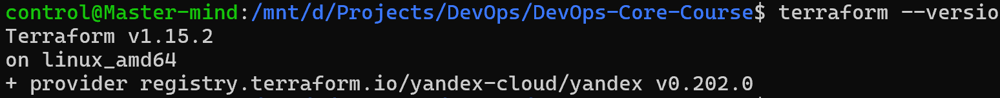
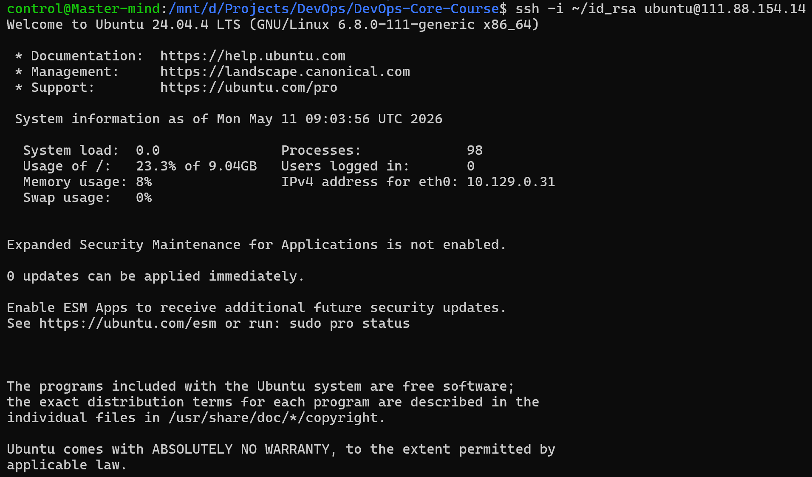
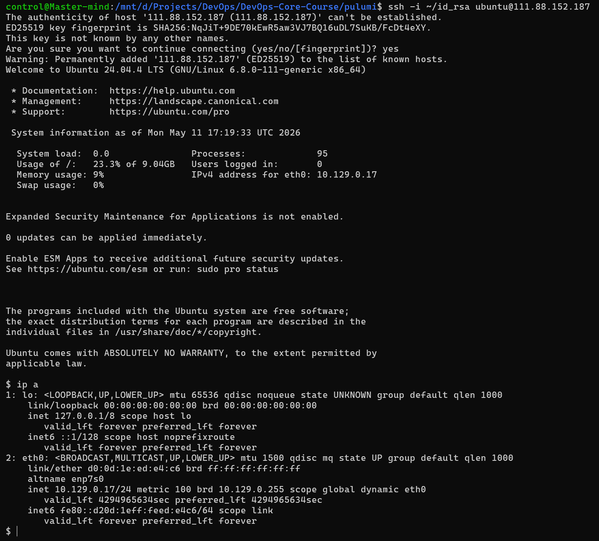

## Task 1: Terraform

Yandex Cloud was chosen as the cloud provider due to accessibility in Russia and convenient free tier.

The following terraform version and provider were utilized to deploy a VM:



### Created Resources Summary

- **Virtual Machine (`minimal-vm`)**:
  - Region/Zone: `ru-central1-b`
  - Platform: `standard-v3`
  - Resources: 2 vCPUs, 2 GB RAM
  - Boot Disk: 10 GB `network-hdd`, Ubuntu 24.04 LTS image
  - Network: Subnet `e2lev91h4vsasfe6gd5v`, NAT enabled, attached to security group `ssh-access`
  - Metadata: Cloud-init for `ubuntu` user with sudo access and SSH key injection

- **Security Group (`ssh-access`)**:
  - Folder ID: `b1g6pc9ifc5v88lqj4ij`
  - Network ID: `enpb8u6so7r1apm1p1b6`
  - Rules:
    - Egress: All outbound traffic (`0.0.0.0/0`)
    - Ingress: SSH (TCP port 22) from anywhere (`0.0.0.0/0`)

- **Provider Context**:
  - Cloud ID: `b1gl3bijlmooaqjl2vp6`
  - Default Zone: `ru-central1-b`


### Terraform outputs

**Terraform plan output:**
```bash
data.yandex_compute_image.ubuntu: Reading...
yandex_vpc_security_group.ssh: Refreshing state... [id=enppbpscn0qttm4uslso]
data.yandex_compute_image.ubuntu: Read complete after 1s [id=fd8kiccpate7vo9kf5pk]

Terraform used the selected providers to generate the following execution plan. Resource actions are indicated with the following
symbols:
  + create

Terraform will perform the following actions:

  # yandex_compute_instance.minimal-vm will be created
  + resource "yandex_compute_instance" "minimal-vm" {
      + created_at                = (known after apply)
      + folder_id                 = (known after apply)
      + fqdn                      = (known after apply)
      + gpu_cluster_id            = (known after apply)
      + hardware_generation       = (known after apply)
      + hostname                  = (known after apply)
      + id                        = (known after apply)
      + maintenance_grace_period  = (known after apply)
      + maintenance_policy        = (known after apply)
      + metadata                  = {
          + "user-data" = <<-EOT
                #cloud-config
                users:
                  - name: ubuntu
                    sudo: ALL=(ALL) NOPASSWD:ALL
                    ssh_authorized_keys:
                      - ssh-rsa AAAAB3NzaC1yc2EAAAADAQABAAABgQDD5dZIue46k72ZLXuG6rTUIFifw2CyGyIU8gJ3912tQ0W47b0d5WR2+Oi9woHWa+HDfOo2a6EkxGMjx8HkfxW302y2+yUagL+fd+U6o0gD06r72N9fVy0C2f4erP4a30eMWMhsG6JqHCHwoHKEoVWCLNg1ZE+VZvnfiDXNrXShv9ABLJhJTH5VBakl4NrOdSEA08aDCJtJCrk+YZs6Jh7llKEbTPoazLPrgGCuxCUhI6FKPHeVK5jry/o51gsBckSuwK/qRYjxV2vFDNl5cLN91oAjjg2Z9kwTu6Cp9woGI9JU/1Yxc8ACwAgZQhWb/3Gm9ad+ZwKRxZ3XQQtP38q7bkiWdxQ4mAuH/kyyjRLcVaIiBU+9XBft6Yl+lPnnhCRT7cO20hap7l02LGuevj9Loc9xkREqq/uP5fn4+FoLGkM/Sifym6x4VZX0H2ZAjUhB30fZ08uXiqCFT0vcluMYzlAYw/sxalPv/yZpgbg7dRxPkFEEqMOZZzlxsJoe+iM= d.prokopyev@innopolis.university
            EOT
        }
      + name                      = "minimal-vm"
      + network_acceleration_type = "standard"
      + platform_id               = "standard-v3"
      + status                    = (known after apply)
      + zone                      = "ru-central1-b"

      + boot_disk {
          + auto_delete = true
          + device_name = (known after apply)
          + disk_id     = (known after apply)
          + mode        = (known after apply)

          + initialize_params {
              + block_size  = (known after apply)
              + description = (known after apply)
              + image_id    = "fd8kiccpate7vo9kf5pk"
              + name        = (known after apply)
              + size        = 10
              + snapshot_id = (known after apply)
              + type        = "network-hdd"
            }
        }

      + metadata_options (known after apply)

      + network_interface {
          + index              = (known after apply)
          + ip_address         = (known after apply)
          + ipv4               = true
          + ipv6               = (known after apply)
          + ipv6_address       = (known after apply)
          + mac_address        = (known after apply)
          + nat                = true
          + nat_ip_address     = (known after apply)
          + nat_ip_version     = (known after apply)
          + security_group_ids = [
              + "enppbpscn0qttm4uslso",
            ]
          + subnet_id          = "e2lev91h4vsasfe6gd5v"
        }

      + placement_policy (known after apply)

      + resources {
          + core_fraction = 20
          + cores         = 2
          + memory        = 2
        }

      + scheduling_policy (known after apply)
    }

Plan: 1 to add, 0 to change, 0 to destroy.

Changes to Outputs:
  + vm_external_ip = (known after apply)

──────────────────────────────────────────────────────────────────────────────────────────────────────────────────────────────────

Note: You didn't use the -out option to save this plan, so Terraform can't guarantee to take exactly these actions if you run
"terraform apply" now.
```

This command confirms the correctness of the setup.

**Terraform apply output:**
```bash
data.yandex_compute_image.ubuntu: Reading...
yandex_vpc_security_group.ssh: Refreshing state... [id=enppbpscn0qttm4uslso]
data.yandex_compute_image.ubuntu: Read complete after 0s [id=fd8kiccpate7vo9kf5pk]

Terraform used the selected providers to generate the following execution plan. Resource actions are indicated with the following
symbols:
  + create

Terraform will perform the following actions:

  # yandex_compute_instance.minimal-vm will be created
  + resource "yandex_compute_instance" "minimal-vm" {
      + created_at                = (known after apply)
      + folder_id                 = (known after apply)
      + fqdn                      = (known after apply)
      + gpu_cluster_id            = (known after apply)
      + hardware_generation       = (known after apply)
      + hostname                  = (known after apply)
      + id                        = (known after apply)
      + maintenance_grace_period  = (known after apply)
      + maintenance_policy        = (known after apply)
      + metadata                  = {
          + "user-data" = <<-EOT
                #cloud-config
                users:
                  - name: ubuntu
                    sudo: ALL=(ALL) NOPASSWD:ALL
                    ssh_authorized_keys:
                      - ssh-rsa AAAAB3NzaC1yc2EAAAADAQABAAABgQDD5dZIue46k72ZLXuG6rTUIFifw2CyGyIU8gJ3912tQ0W47b0d5WR2+Oi9woHWa+HDfOo2a6EkxGMjx8HkfxW302y2+yUagL+fd+U6o0gD06r72N9fVy0C2f4erP4a30eMWMhsG6JqHCHwoHKEoVWCLNg1ZE+VZvnfiDXNrXShv9ABLJhJTH5VBakl4NrOdSEA08aDCJtJCrk+YZs6Jh7llKEbTPoazLPrgGCuxCUhI6FKPHeVK5jry/o51gsBckSuwK/qRYjxV2vFDNl5cLN91oAjjg2Z9kwTu6Cp9woGI9JU/1Yxc8ACwAgZQhWb/3Gm9ad+ZwKRxZ3XQQtP38q7bkiWdxQ4mAuH/kyyjRLcVaIiBU+9XBft6Yl+lPnnhCRT7cO20hap7l02LGuevj9Loc9xkREqq/uP5fn4+FoLGkM/Sifym6x4VZX0H2ZAjUhB30fZ08uXiqCFT0vcluMYzlAYw/sxalPv/yZpgbg7dRxPkFEEqMOZZzlxsJoe+iM= d.prokopyev@innopolis.university
            EOT
        }
      + name                      = "minimal-vm"
      + network_acceleration_type = "standard"
      + platform_id               = "standard-v3"
      + status                    = (known after apply)
      + zone                      = "ru-central1-b"

      + boot_disk {
          + auto_delete = true
          + device_name = (known after apply)
          + disk_id     = (known after apply)
          + mode        = (known after apply)

          + initialize_params {
              + block_size  = (known after apply)
              + description = (known after apply)
              + image_id    = "fd8kiccpate7vo9kf5pk"
              + name        = (known after apply)
              + size        = 10
              + snapshot_id = (known after apply)
              + type        = "network-hdd"
            }
        }

      + metadata_options (known after apply)

      + network_interface {
          + index              = (known after apply)
          + ip_address         = (known after apply)
          + ipv4               = true
          + ipv6               = (known after apply)
          + ipv6_address       = (known after apply)
          + mac_address        = (known after apply)
          + nat                = true
          + nat_ip_address     = (known after apply)
          + nat_ip_version     = (known after apply)
          + security_group_ids = [
              + "enppbpscn0qttm4uslso",
            ]
          + subnet_id          = "e2lev91h4vsasfe6gd5v"
        }

      + placement_policy (known after apply)

      + resources {
          + core_fraction = 20
          + cores         = 2
          + memory        = 2
        }

      + scheduling_policy (known after apply)
    }

Plan: 1 to add, 0 to change, 0 to destroy.

Changes to Outputs:
  + vm_external_ip = (known after apply)

Do you want to perform these actions?
  Terraform will perform the actions described above.
  Only 'yes' will be accepted to approve.

  Enter a value: yes

yandex_compute_instance.minimal-vm: Creating...
yandex_compute_instance.minimal-vm: Still creating... [00m10s elapsed]
yandex_compute_instance.minimal-vm: Still creating... [00m20s elapsed]
yandex_compute_instance.minimal-vm: Still creating... [00m30s elapsed]
yandex_compute_instance.minimal-vm: Still creating... [00m40s elapsed]
yandex_compute_instance.minimal-vm: Still creating... [00m50s elapsed]
yandex_compute_instance.minimal-vm: Creation complete after 51s [id=epd84uul6u39e4vtql7r]

Apply complete! Resources: 1 added, 0 changed, 0 destroyed.

Outputs:

vm_external_ip = "111.88.154.14"
```

As a result of `terraform apply` the public IP address was provided: 111.88.154.14
SSH connection command: `ssh -i ~/id_rsa ubuntu@111.88.154.14`

**Proof of ssh connection with the Terraform-deployed VM:**


```terraform_destroy
data.yandex_compute_image.ubuntu: Reading...
yandex_vpc_security_group.ssh: Refreshing state... [id=enppbpscn0qttm4uslso]
data.yandex_compute_image.ubuntu: Read complete after 1s [id=fd8kiccpate7vo9kf5pk]
yandex_compute_instance.minimal-vm: Refreshing state... [id=epd84uul6u39e4vtql7r]

Terraform used the selected providers to generate the following execution plan. Resource actions are indicated with the following
symbols:
  - destroy

Terraform will perform the following actions:

  # yandex_compute_instance.minimal-vm will be destroyed
  - resource "yandex_compute_instance" "minimal-vm" {
      - created_at                = "2026-05-11T08:54:40Z" -> null
      - folder_id                 = "b1g6pc9ifc5v88lqj4ij" -> null
      - fqdn                      = "epd84uul6u39e4vtql7r.auto.internal" -> null
      - hardware_generation       = [
          - {
              - generation2_features = []
              - legacy_features      = [
                  - {
                      - pci_topology = "PCI_TOPOLOGY_V2"
                    },
                ]
            },
        ] -> null
      - id                        = "epd84uul6u39e4vtql7r" -> null
      - labels                    = {} -> null
      - metadata                  = {
          - "user-data" = <<-EOT
                #cloud-config
                users:
                  - name: ubuntu
                    sudo: ALL=(ALL) NOPASSWD:ALL
                    ssh_authorized_keys:
                      - ssh-rsa AAAAB3NzaC1yc2EAAAADAQABAAABgQDD5dZIue46k72ZLXuG6rTUIFifw2CyGyIU8gJ3912tQ0W47b0d5WR2+Oi9woHWa+HDfOo2a6EkxGMjx8HkfxW302y2+yUagL+fd+U6o0gD06r72N9fVy0C2f4erP4a30eMWMhsG6JqHCHwoHKEoVWCLNg1ZE+VZvnfiDXNrXShv9ABLJhJTH5VBakl4NrOdSEA08aDCJtJCrk+YZs6Jh7llKEbTPoazLPrgGCuxCUhI6FKPHeVK5jry/o51gsBckSuwK/qRYjxV2vFDNl5cLN91oAjjg2Z9kwTu6Cp9woGI9JU/1Yxc8ACwAgZQhWb/3Gm9ad+ZwKRxZ3XQQtP38q7bkiWdxQ4mAuH/kyyjRLcVaIiBU+9XBft6Yl+lPnnhCRT7cO20hap7l02LGuevj9Loc9xkREqq/uP5fn4+FoLGkM/Sifym6x4VZX0H2ZAjUhB30fZ08uXiqCFT0vcluMYzlAYw/sxalPv/yZpgbg7dRxPkFEEqMOZZzlxsJoe+iM= d.prokopyev@innopolis.university
            EOT
        } -> null
      - name                      = "minimal-vm" -> null
      - network_acceleration_type = "standard" -> null
      - platform_id               = "standard-v3" -> null
      - status                    = "running" -> null
      - zone                      = "ru-central1-b" -> null
        # (5 unchanged attributes hidden)

      - boot_disk {
          - auto_delete = true -> null
          - device_name = "epd89kiqg1mho4vqg6f7" -> null
          - disk_id     = "epd89kiqg1mho4vqg6f7" -> null
          - mode        = "READ_WRITE" -> null

          - initialize_params {
              - block_size  = 4096 -> null
              - image_id    = "fd8kiccpate7vo9kf5pk" -> null
                name        = null
              - size        = 10 -> null
              - type        = "network-hdd" -> null
                # (3 unchanged attributes hidden)
            }
        }

      - metadata_options {
          - aws_v1_http_endpoint = 1 -> null
          - aws_v1_http_token    = 2 -> null
          - gce_http_endpoint    = 1 -> null
          - gce_http_token       = 1 -> null
        }

      - network_interface {
          - index              = 0 -> null
          - ip_address         = "10.129.0.31" -> null
          - ipv4               = true -> null
          - ipv6               = false -> null
          - mac_address        = "d0:0d:82:7b:d5:37" -> null
          - nat                = true -> null
          - nat_ip_address     = "111.88.154.14" -> null
          - nat_ip_version     = "IPV4" -> null
          - security_group_ids = [
              - "enppbpscn0qttm4uslso",
            ] -> null
          - subnet_id          = "e2lev91h4vsasfe6gd5v" -> null
            # (1 unchanged attribute hidden)
        }

      - placement_policy {
          - host_affinity_rules       = [] -> null
          - placement_group_partition = 0 -> null
            # (1 unchanged attribute hidden)
        }

      - resources {
          - core_fraction = 20 -> null
          - cores         = 2 -> null
          - gpus          = 0 -> null
          - memory        = 2 -> null
        }

      - scheduling_policy {
          - preemptible = false -> null
        }
    }

  # yandex_vpc_security_group.ssh will be destroyed
  - resource "yandex_vpc_security_group" "ssh" {
      - created_at  = "2026-05-11T08:48:54Z" -> null
      - description = "Allow SSH" -> null
      - folder_id   = "b1g6pc9ifc5v88lqj4ij" -> null
      - id          = "enppbpscn0qttm4uslso" -> null
      - labels      = {} -> null
      - name        = "ssh-access" -> null
      - network_id  = "enpb8u6so7r1apm1p1b6" -> null
      - status      = "ACTIVE" -> null

      - egress {
          - description       = "Allow all outbound" -> null
          - from_port         = -1 -> null
          - id                = "enpp093rop01i74a658a" -> null
          - labels            = {} -> null
          - port              = -1 -> null
          - protocol          = "ANY" -> null
          - to_port           = -1 -> null
          - v4_cidr_blocks    = [
              - "0.0.0.0/0",
            ] -> null
          - v6_cidr_blocks    = [] -> null
            # (2 unchanged attributes hidden)
        }

      - ingress {
          - description       = "SSH from anywhere" -> null
          - from_port         = -1 -> null
          - id                = "enpinie4cuspm6kj593v" -> null
          - labels            = {} -> null
          - port              = 22 -> null
          - protocol          = "TCP" -> null
          - to_port           = -1 -> null
          - v4_cidr_blocks    = [
              - "0.0.0.0/0",
            ] -> null
          - v6_cidr_blocks    = [] -> null
            # (2 unchanged attributes hidden)
        }
    }

Plan: 0 to add, 0 to change, 2 to destroy.

Changes to Outputs:
  - vm_external_ip = "111.88.154.14" -> null

Do you really want to destroy all resources?
  Terraform will destroy all your managed infrastructure, as shown above.
  There is no undo. Only 'yes' will be accepted to confirm.

  Enter a value: yes

yandex_compute_instance.minimal-vm: Destroying... [id=epd84uul6u39e4vtql7r]
yandex_compute_instance.minimal-vm: Still destroying... [id=epd84uul6u39e4vtql7r, 00m10s elapsed]
yandex_compute_instance.minimal-vm: Still destroying... [id=epd84uul6u39e4vtql7r, 00m20s elapsed]
yandex_compute_instance.minimal-vm: Still destroying... [id=epd84uul6u39e4vtql7r, 00m30s elapsed]
yandex_compute_instance.minimal-vm: Destruction complete after 32s
yandex_vpc_security_group.ssh: Destroying... [id=enppbpscn0qttm4uslso]
yandex_vpc_security_group.ssh: Destruction complete after 1s

Destroy complete! Resources: 2 destroyed.
```

___

## Task 2: Pulumi

Python was chosen as a language for Pulumi to manage infrastructure.
A new project was initialized with `pulumi new python`, and `__main__` file now contains the implementation of infrastructure deployment similar to the terraform config.


```bash
Previewing update (dev)

View in Browser (Ctrl+O): <hiding private link>

     Type                               Name            Plan
 +   pulumi:pulumi:Stack                DevOpsLab4-dev  create
 +   └─ pulumi-python:dynamic:Resource  minimal-vm      create

Outputs:
    vm_external_ip: [unknown]

Resources:
    + 2 to create
```

**Pulumi up output:**
```bash
control@Master-mind:/mnt/d/Projects/DevOps/DevOps-Core-Course/pulumi$ pulumi up --yes -v=3
Enter your passphrase to unlock config/secrets
    (set PULUMI_CONFIG_PASSPHRASE or PULUMI_CONFIG_PASSPHRASE_FILE to remember):
Enter your passphrase to unlock config/secrets
Previewing update (dev):
     Type                               Name            Plan       Info
     pulumi:pulumi:Stack                DevOpsLab4-dev
 ~   └─ pulumi-python:dynamic:Resource  minimal-vm      update     [diff: ~__provider]

Outputs:
  + vm_external_ip: [unknown]

Resources:
    ~ 1 to update
    1 unchanged

Updating (dev):
     Type                               Name            Status              Info
     pulumi:pulumi:Stack                DevOpsLab4-dev
 ~   └─ pulumi-python:dynamic:Resource  minimal-vm      updated (0.01s)     [diff: ~__provider]

Outputs:
  + vm_external_ip: 111.88.152.187

Resources:
    ~ 1 updated
    1 unchanged

Duration: 17s
```

**Proof of ssh connection with the Pulumi-deployed VM:**


Pulumi VM public IP: 111.88.152.187


## Expierience Comparison

What was easier/harder?
    - I consider Terraform somewhat easier to use due to its standardized configuration with minimal dependencies besides Terraform itself.
How does the code differ?
    - Terraform code is a declarative configuration that describes the desired state of the infrastructure. Pulumi code, on the other hand, is more imperative and language-dependent, describing how to initialize the infrastructure.
Which approach do you prefer and why?
    - In a general case I prefer Terraform approach due to its declarative nature which fits most contexts well. If I had to develop a custom infrastructure setup pipeline, however, I would prefere Pulumi for its flexibility.

> VM Choice: Keeping the Terraform-managed VM for Lab 5.
